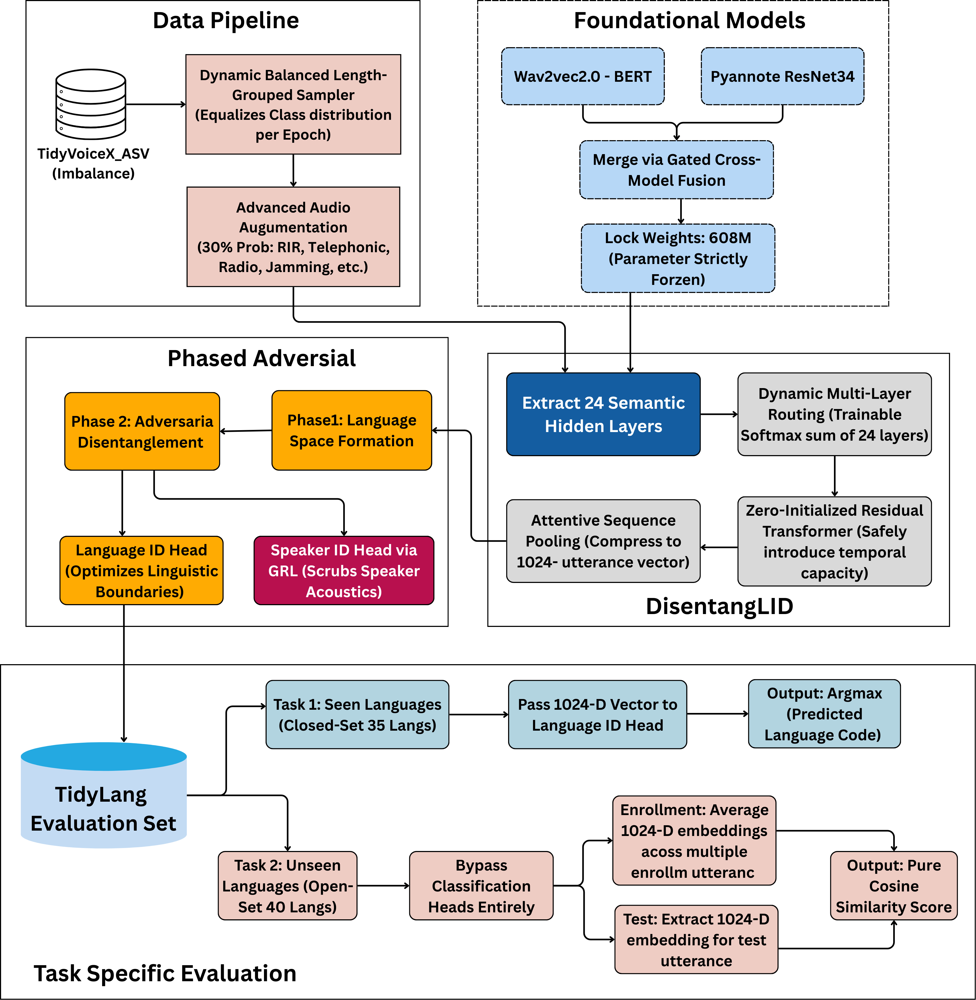
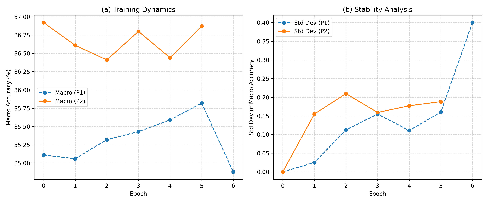

# SpeechEncoder-TidyLang
Disentangled Speech Encoder: A Robust Encoder with Dynamic Adapter for Language Identification

Spoken Language Recognition (SLR) in multilingual open set tasks is challenging due to the overlap between linguistic
and speaker specific traits. Fine-tuning large foundation models distorts phonetic representations or leads to overfitting, limiting
generalization to unseen speakers. To address this, we propose DisentangLID, a robust adaptation framework for the TidyLang
Challenge integrating a frozen dual branch backbone with a lightweight adapter and adversarial learning to enforce speaker
invariant representations. The method aligns semantic representations from Wav2Vec-2.0-BERT with acoustic features from a
ResNet34 encoder while preserving pretrained space. A key contribution is a controlled adaptation strategy that prevents feature drift while enabling task specific refinement. Balanced
sampling and a two stage adversarial scheme improve robustness. The model achieves 96.01 micro and 86.92 macro accuracy on validation, and 90.33 micro, 83.43 macro accuracy on  the test set.

### Training


### Training Stability on Validation Set

Training dynamics and stability analysis of the proposed framework on the validation set. (a) Macro accuracy across training
epochs for Phase 1 (without adversarial training) and Phase 2 (with adversarial disentanglement). (b) Stability analysis based on the
rolling standard deviation of macro accuracy, highlighting reduced variability in Phase 2 compared to Phase 1. These trends suggest
that adversarial training contributes to more stable convergence and improved generalization.

### Evaluation on TidyLang Testset

```json
============================================================
TidyLang Challenge 2026 - Scoring
Speaker-Controlled Language Recognition
============================================================

Submission directory contents:
  - tl26_closed_lid.txt
  - tl26_closed_pairs.txt
  - metadata

Reference directory contents:
  - tl26_lid.txt
  - tl26_pairs.txt

Loading reference data...
  LID reference: 7,209 labels
  Pairs reference: 4,000,000 labels

============================================================
Language Identification (tl26_closed_lid.txt)
Metrics: Macro Accuracy, Micro Accuracy
============================================================
Loaded 7,209 predictions
Results:
  Macro Accuracy: 83.4336%
  Micro Accuracy: 90.3315%
  Number of languages: 25

============================================================
Verification Pairs (tl26_closed_pairs.txt)
Metrics: EER, minDCF
============================================================
Loaded 4,000,000 scores
Results:
  EER: 17.7131%
  minDCF (Ptar=0.01): 1.0000

  Trial statistics:
    Target trials: 1,600,000
    Non-target trials: 2,400,000

============================================================
FINAL SCORES
============================================================
{
  "macro_accuracy": 83.4336,
  "micro_accuracy": 90.3315,
  "eer": 17.7131,
  "mindcf": 1.0
}

Scores written to /app/output/scores.json
```

### Installation

```commandline
git clone https://github.com/rbg-research/SpeechEncoder-TidyLang.git
cd SpeechEncoder-TidyLang
pip install -r requirements.txt
```

### Download Model
```commandline
gdown 1qXVDEZOdbnCvXJghj-yFPWCxbAPtCg3w
```

### Inference
Single File Inference [Notebook](inference.ipynb)

#### Complete Installation

```commandline
sudo apt update
sudo apt install -y software-properties-common
sudo apt install -y ffmpeg libavcodec-dev libavformat-dev libavutil-dev libswresample-dev libswscale-dev
sudo add-apt-repository ppa:deadsnakes/ppa
sudo apt update
sudo apt install -y python3.10 python3.10-dev python3.10-distutils
wget https://bootstrap.pypa.io/get-pip.py
source ~/.bashrc
python3.10 get-pip.py
echo 'export PATH="$HOME/.local/bin:$PATH"' >> ~/.bashrc
source ~/.bashrc
pip3.10 install -U pip
rm get-pip.py
pip3.10 install virtualenv
virtualenv --python=python3.10 "$HOME"/environments/tidylang
source "$HOME"/environments/tidylang/bin/activate
```

##### Jupyter Notebook
```commandline
pip install jupyter
pip install ipykernel
python -m ipykernel install --user --name=tidylang
```

